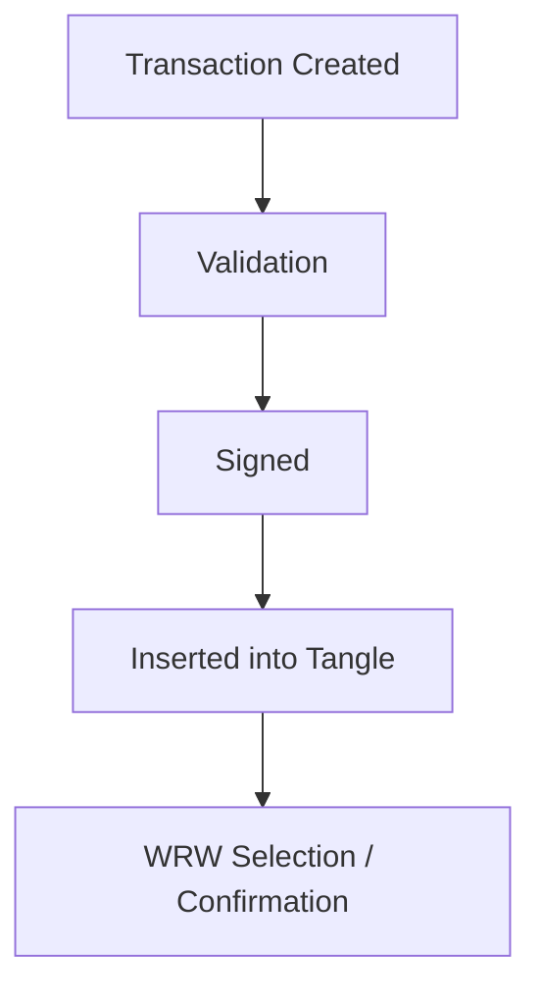

# EcoWeave Library Documentation

EcoWeave is a Rust library designed to manage and validate a local Tangle structure for secure environmental data collection, particularly for IoT devices. It provides transaction handling, digital signature support, and a lightweight consensus mechanism suitable for decentralized applications.

---

## Table of Contents
1. [Overview](#overview)
2. [Features](#features)
    - [Create a Transaction](#1-create-a-transaction)
    - [Validate a Transaction](#2-validate-a-transaction)
    - [Sign a Transaction](#3-sign-a-transaction)
    - [Validate a Transaction's Signature](#4-validate-a-transactions-signature)
    - [Add a Transaction to the Tangle](#5-add-a-transaction-to-the-tangle)
    - [Perform Weighted Random Walk (WRW)](#6-perform-weighted-random-walk-wrw)
3. [How to Use the Library](#how-to-use-the-library)
4. [Transaction Lifecycle](#transaction-lifecycle)

---

## Overview

EcoWeave enables the secure handling of transactions in a local Tangle-based structure. It is particularly well-suited for edge devices or isolated nodes collecting and validating IoT data, without requiring a full P2P network stack.

---

## Features

### 1. **Create a Transaction**
Generate a new transaction with an ID, timestamp, and custom payload.

```rust
use eco_weave::Transaction;

let tx = Transaction::new("tx1", "{\"temperature\":25.6}");
println!("{:?}", tx);
```

### 2. **Validate a Transaction**
Ensure the transaction follows expected structure and content rules.

```rust
let tx = Transaction::new("tx1", "{\"temperature\":25.6}");
match tx.validate() {
    Ok(_) => println!("Transaction is valid"),
    Err(err) => println!("Validation error: {}", err),
}
```

### 3. **Sign a Transaction**
Digitally sign a transaction to ensure its authenticity.

```rust
use ed25519_dalek::SigningKey;
use rand::rngs::OsRng;

let mut rng = OsRng;
let signing_key = SigningKey::generate(&mut rng);

let mut tx = Transaction::new("tx1", "{\"temperature\":25.6}");
tx.sign(&signing_key);

println!("Signed transaction: {:?}", tx);
```

### 4. **Validate a Transaction's Signature**
Verify a transaction's digital signature using a public key.

```rust
use ed25519_dalek::VerifyingKey;

let verifying_key = signing_key.verifying_key();

match tx.validate_signature(&verifying_key) {
    Ok(_) => println!("Signature is valid"),
    Err(err) => println!("Invalid signature: {}", err),
}
```

### 5. **Add a Transaction to the Tangle**
Insert a validated transaction into the local Tangle structure.

```rust
use eco_weave::{Tangle, Transaction};

let mut tangle = Tangle::new();
let tx = Transaction::new("tx1", "{\"temperature\":25.6}");

if tangle.add_transaction(tx) {
    println!("Transaction added to the Tangle.");
} else {
    println!("Failed to add transaction.");
}
```

### 6. **Perform Weighted Random Walk (WRW)**
Select a transaction from the Tangle based on transaction weights.

```rust
let mut tx1 = Transaction::new("tx1", "{\"temperature\":25.6}");
tx1.weight = 10;
tangle.add_transaction(tx1);

let mut tx2 = Transaction::new("tx2", "{\"humidity\":60.5}");
tx2.weight = 20;
tangle.add_transaction(tx2);

if let Some(selected_tx) = tangle.weighted_random_walk() {
    println!("Selected transaction: {}", selected_tx);
} else {
    println!("No transaction selected.");
}
```

---

## How to Use the Library

### 1. Add EcoWeave to Your Project

In `Cargo.toml`:
```toml
[dependencies]
eco_weave = { path = "../eco_weave" }
```

### 2. Import the Library

In your Rust code:
```rust
use eco_weave::{Tangle, Transaction};
```

---

## Transaction Lifecycle

1. **Transaction Creation**: A new transaction is created.
2. **Validation**: It is validated locally.
3. **Signing**: The transaction is signed by the issuer.
4. **Insertion**: It is added to the local Tangle if valid.
5. **Consensus (Local)**: The transaction is included in local logic through WRW.



---

EcoWeave provides a lightweight yet powerful way to handle decentralized transaction logic for constrained or embedded environments. It is ideal for projects seeking local consensus without complex networking layers.